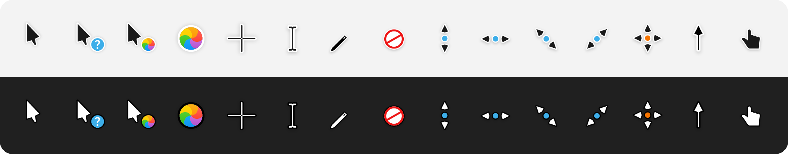

<div align="center">

# Capitaine Cursors for Windows

**macOS-inspired Capitaine cursors for Windows 11, rendered from the original vector artwork at every size Windows
picks for your display scale and pointer size. Dark and Light variants.**

[](https://github.com/hervad/capitaine-cursors-w11-hidpi/releases/latest)
[](#install)
[](COPYING)



</div>

## Install

1. **Download** the zip for your variant from the [latest release](https://github.com/hervad/capitaine-cursors-w11-hidpi/releases/latest)
   and extract it.
2. **Right-click** `install.inf` in the extracted folder and choose **Install**, then approve the administrator prompt.
   On Windows 11, **Install** is under **Show more options**.
3. **Apply:** Mouse Properties may open by itself; if it doesn't, press <kbd>Win</kbd>+<kbd>R</kbd> and run `main.cpl`.
   On the **Pointers** tab, pick the scheme and click **OK**.

**Upgrading from 2.0 or 1.0?** Remove the old version first, so the scheme doesn't appear twice - the
[installation guide](INSTALL.md#upgrading) has the commands.

## Pick a variant

| | Dark | Light |
| --- | --- | --- |
| **Look** | Black pointer, white outline | White pointer, black outline |
| **Zip** | `capitaine-dark-w11-hidpi-v….zip` | `capitaine-light-w11-hidpi-v….zip` |
| **Scheme name** | Capitaine Cursors (Dark) | Capitaine Cursors (Light) |

Both are outlined, so either one stays visible on any background. Install both and switch whenever you like.

## Why they stay sharp

Windows doesn't scale cursors smoothly. It takes the pointer size from **Settings › Accessibility › Mouse pointer
and touch** (size 1 = 32 px, each step adds 16 px), multiplies it by a factor that depends on your display scale,
and then looks for an image of exactly that size inside the cursor file. If the file doesn't have it, Windows
resamples the nearest one, and resampling blurs.

Every cursor here contains each of those sizes, rendered from the original vector artwork, never resampled:

| Display scale | Pointer size 1 | Size 2 | Size 3 | Size 4 | Size 5 | |
| --- | :-: | :-: | :-: | :-: | :-: | --- |
| 100–149 % | 32 px | 48 px | 64 px | 80 px | 96 px | measured |
| 150–199 % | 48 px | 72 px | 96 px | 120 px | 144 px | measured |
| 200–249 % | 64 px | 96 px | 128 px | 160 px | 192 px | assumed |
| 250–299 % | 80 px | 120 px | 160 px | 200 px | 240 px | assumed |
| 300 %+ | 96 px | 144 px | 192 px | 240 px | 256 px | assumed |

The two **measured** rows come from a size probe on Windows 11 25H2 (build 26200), where the factor is 1.0 from
100 % to 149 % and 1.5 from 150 % to 199 %. The **assumed** rows continue that pattern; they couldn't be measured
on the test screen, so the files simply include those sizes as well. Larger pointer sizes follow the same rule,
up to Windows' 256 px maximum.

- **Static cursors** are exact for every pointer size in every row.
- **Busy and working** (animated) are exact for pointer sizes 1–5 at 100–149 % and 150–199 %, and also carry 192
  and 256 px. Elsewhere Windows resizes the closest image.
- **At 125 % and 175 %** some softness is normal and can't be fixed by any cursor theme: Windows uses the 100 % or
  150 % image there and stretches it to fit.

**No performance cost.** Windows decodes a cursor once, when you switch scheme or pointer size, and animation only
flips between images it has already decoded. Measured on Windows 11 25H2 against Microsoft's own `aero` cursors
(same machine, same run):

| | Capitaine | Windows aero |
| --- | --- | --- |
| Load a static cursor (32–96 px) | 0.2–0.3 ms | 0.1–0.2 ms |
| Load an animated cursor (32–96 px) | 3–5 ms | 1–4 ms |
| Load an animated cursor (256 px) | 15 ms | 20 ms |
| GDI / USER handles left behind after 300 loads | 0 / 0 | 0 / 0 |

Before every release, GitHub Actions loads every file with the real Windows cursor loader at several sizes; a
failure blocks the release.

## What's included

- **All 17 Windows pointer roles:** normal, help, working in background, busy, precision, text, handwriting,
  unavailable, 4 resize directions, move, alternate, link, location and person select. Location and person select use
  the pointing hand (Capitaine has no artwork for them; before 3.0 they were left empty).
- **Animated busy and working cursors:** 24 frames at 30 fps, as in the original.
- **Hotspots** on the tip or centre at every size; the pen's is on the pencil tip.
- `install.inf` and `uninstall.cmd` for each variant, plus the licence and attribution.

## Uninstall

1. Run `uninstall.cmd` from the extracted folder. It removes the scheme from the list and opens Mouse Properties.
2. Pick another scheme and click **OK**.
3. Delete the cursor files from an administrator PowerShell, for example:

```powershell
Remove-Item "C:\Windows\Cursors\Capitaine Cursors (Dark)" -Recurse
```

## Build from source

Since 3.0 the cursors are built with [w11-cursor-toolkit](https://github.com/hervad/w11-cursor-toolkit) from the
original repository, pinned as a git submodule in `upstream/` at
[commit 06c8843](https://github.com/keeferrourke/capitaine-cursors/tree/06c88433662a4004cf56a6e471b523a0a8880be0).
Rendering uses resvg, which the toolkit installs.

```powershell
git clone --recurse-submodules https://github.com/hervad/capitaine-cursors-w11-hidpi
cd capitaine-cursors-w11-hidpi
python -m pip install "w11cursor @ git+https://github.com/hervad/w11-cursor-toolkit@v0.4.0"
w11cursor build    theme.toml --out dist
w11cursor validate theme.toml --dist dist
```

Releases are built by GitHub Actions from a version tag. [TECHNICAL.md](TECHNICAL.md) explains the sizes, hotspots
and animation limits.

## Credits

The artwork is [Capitaine Cursors](https://github.com/keeferrourke/capitaine-cursors) by
[Keefer Rourke](https://krourke.org) and contributors, based on [KDE Breeze](https://invent.kde.org/plasma/breeze).
This project packages it for Windows. See [CREDITS.md](CREDITS.md).

Licensed under the [GNU LGPL v3.0 or later](COPYING).
